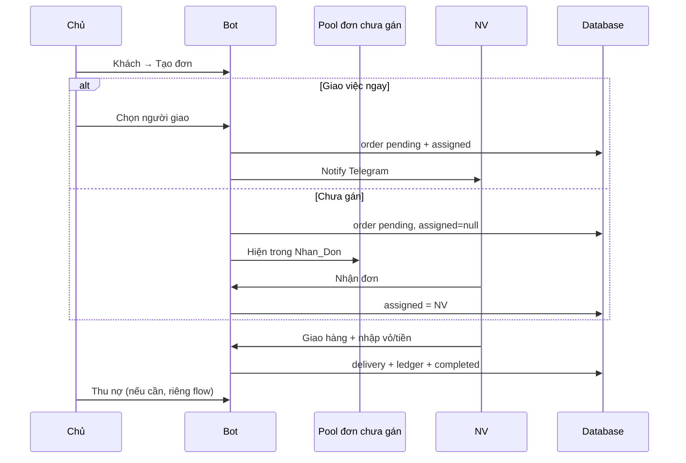

# GasOS — User Flow

**Phiên bản:** 2.0 | **Cập nhật:** 2026-06-24  
**Trạng thái:** Roadmap đã chốt — **chưa code** (chờ 「TÔI PHÊ DUYỆT」)

---

## Mục tiêu

Mô tả luồng người dùng **mục tiêu** theo mind map menu bot + web dashboard.  
Phần **Hiện trạng code** ở cuối để đối chiếu khi triển khai.

---

## Quyết định đã chốt (2026-06-24)

| Hạng mục | Quyết định |
|----------|------------|
| Super admin | **Chưa phát triển** — `/menu_super_admin` placeholder/backlog |
| Nhận đơn (NV) | Chỉ đơn **chưa gán** (`assignedEmployeeId = null`); **không đè** đơn đã gán |
| Hoàn thành giao | **Nhân viên** — Xem đơn → Giao hàng → nhập vỏ/tiền |
| Thu nợ | **Chủ đại lý only** — bỏ khỏi menu NV |
| Top 10 khách (admin) | Sort theo **số lần giao hoàn thành** (completed orders), giảm dần |
| Mã mời NV (bot) | Nút **「+ Tạo mã mời NV」** trong **Đội ngũ** (+ giữ trên web Đội ngũ) |
| Web đăng nhập | Lệnh **`/weblogin`** trong `/help` (thay entry ẩn trong Thống kê) |

---

## A. Kích hoạt tài khoản

```
Nhận mã GAS-XXXXXXXX (owner seed / mã mời NV)
  → /start <mã> hoặc deep link t.me/bot?start=...
  → Tạo user (+ employee record nếu NV)
  → Vào menu theo role
```

| Role | Menu sau kích hoạt |
|------|---------------------|
| `owner` | `/menu_admin` (hoặc alias `/menu`) |
| `employee` | `/nhan_vien` (hoặc alias `/menu`) |
| super admin | `/menu_super_admin` — **backlog, chưa có nội dung** |

---

## B. Lệnh gốc

| Lệnh | Ai dùng | Mục đích |
|------|---------|----------|
| `/start [mã]` | Mọi người | Kích hoạt lần đầu hoặc quay menu |
| `/menu_admin` | Chủ | Menu quản trị cửa hàng |
| `/nhan_vien` | NV | Menu nhân viên |
| `/menu_super_admin` | — | **Backlog** |
| `/help` | Chủ (+ NV?) | Trợ giúp lệnh |
| `/weblogin` | Chủ | Lệnh tắt — cùng chức năng **Thống kê → Đăng nhập web** |
| `/no <query>` | Chủ, NV | Tra nợ nhanh (giữ tùy chọn) |

### Trợ giúp (nút ❓ / lệnh `/help`)

Nội dung **chi tiết từng bước** — không chỉ liệt kê lệnh. Khác nhau theo vai trò:

| Đối tượng | Nội dung chính |
|-----------|----------------|
| Chưa kích hoạt | Cách /start + mã mời |
| Chủ | Kích hoạt, từng nút menu, thêm khách, lên đơn, thu nợ, đơn mở, mời NV |
| NV | Kích hoạt, xem/nhận đơn, cú pháp giao hàng (VD tm/ck/no), lưu ý không thu nợ |

**Đăng nhập web:** chỉ qua **📊 Thống kê → 🌐 Đăng nhập web** (không nút trong Trợ giúp). Lệnh `/weblogin` là shortcut tùy chọn.

Source: `src/bot/help-content.ts`

---

## C. Menu Admin — `/menu_admin`

```
/menu_admin
├── Doi_Ngu
├── Khach_Hang
├── Thong_Ke
├── Cai_Dat
└── Trợ giúp          → /help, /weblogin, /start…
```

> **Không còn** nút **「📞 Lên đơn」** ở menu gốc — lên đơn đi từ **Khách hàng → Tạo đơn**.

---

### C1. Doi_Ngu (Quản lý nhân sự)

```
Doi_Ngu
├── Danh sách: Chủ + NV (vai trò, Telegram, trạng thái)
├── [+ Tạo mã mời NV]     → mã GAS-… + deep link (TTL 72h)
└── Chọn người → Chi_Tiet_Nhan_Su
    ├── Cap_Nhat          → Sửa tên, SĐT (đồng bộ Telegram nếu đã kích hoạt)
    └── Giao_Viec
        └── Tim_Ma_Don    → Gõ mã đơn → gán/reassign NV (chỉ đơn pending/delivering)
```

**Giao việc từ Đội ngũ:** chủ chọn NV → nhập **mã đơn** → gán **chỉ khi đơn chưa có người nhận**. Sau khi NV **Nhan_Don** (hoặc đã gán người giao), **khóa** — chủ không gán lại.

**Mã mời NV:** chỉ ở **Đội ngũ** trên bot; web dashboard **Đội ngũ** giữ nút tương tự.

---

### C2. Khach_Hang (Quản lý khách hàng)

```
Khach_Hang
├── Top 10 khách          → 10 khách có **nhiều lần giao hoàn thành** nhất
└── Tim_Kiem / Xem_them   → Tìm tên/SĐT/địa chỉ, phân trang
    └── Chi_Tiet_Khach
        ├── Thông tin + nợ + (vỏ nếu bật ledger)
        ├── [Thêm khách]  (flow Tên | SĐT | Địa chỉ)
        └── Tao_Don
            ├── Chọn loại bình + SL → xác nhận
            ├── Giao_Viec           → Chọn người giao HOẶC để trống (chưa gán)
            └── Quay_Lai_Khach_Hang
```

**Top 10 — metric:** `COUNT(delivery_orders WHERE status = 'completed')` theo `customerId`, sort DESC.  
Khách chưa từng giao xong **không** vào top 10 (vẫn tìm được qua Tim_Kiem).

**Tạo đơn — giao việc:**

| Số người có thể giao* | Hành vi |
|------------------------|---------|
| 1 (chỉ chủ, chưa có NV) | Tự gán chủ hoặc **để trống** → NV/chủ **Nhận đơn** |
| 1 (chủ + 0 NV active nhưng có 1 “worker”) | Tự gán |
| ≥ 2 (chủ + ≥1 NV active) | Chọn người giao **hoặc** bỏ trống → pool **Nhận đơn** |

\*Người có thể giao = chủ (luôn) + NV `active`.

**Đơn chưa gán:** pool **Nhận đơn** (NV). Chủ xem/quản lý đơn mở: **Thống kê → Đơn hàng → Quản lý đơn mở** (không ở menu gốc).

---

### C3. Thong_Ke (Thống kê)

```
Thong_Ke
├── Tong_Quan
│   ├── Số admin (owner)      — MVP: 1
│   ├── Số NV active
│   ├── Số khách active
│   ├── Doanh thu tháng
│   └── Tổng công nợ
├── Thong_Ke_Theo_Nhan_Vien
├── Thong_Ke_Theo_Khach
├── Thong_Ke_Thang
└── Thong_Ke_Tuan
```

Chi tiết drill-down: text/card trên Telegram (không chart phức tạp — khớp dashboard rule).

---

### C4. Cai_Dat → Gas

```
Cai_Dat
└── Gas
    ├── Danh sách (tối đa 10 loại): tên, dung tích kg, **giá hiện tại**
    │   ├── Chi tiet
    │   └── Update (tên/kg/giá — theo đợt giá hiện tại)
    └── Xem_Them / Tao_Moi   (nếu < 10 loại)
```

**Không** đặt mã mời NV ở đây (đã chuyển sang Đội ngũ).

---

### C5. Thu nợ (chủ only)

```
Menu admin hoặc Chi tiết khách
└── Thu nợ
    → Tìm khách → nhập số tiền tm/ck
    → Ghi payment + debt_ledger
```

NV **không** có Thu nợ trên menu (có thể vẫn **Check_Cong_No** = tra nợ, read-only).

---

## D. Menu Nhân viên — `/nhan_vien`

```
/nhan_vien
├── Xem_Don           → Đơn **đã gán cho mình** (pending + delivering)
├── Nhan_Don          → Đơn **chưa gán ai** — bấm nhận → gán employeeId = mình
└── Check_Cong_No     → Tra nợ (read-only, giống Tra nợ hiện tại)
```

### Xem_Don → Hoàn thành giao

```
Chi tiết đơn (assigned = mình)
  → [Giao hàng]
  → status delivering
  → Nhập compact: <vỏ thu...> <tiền>vnd <tm|ck|no> [gas kg...]
  → Xác nhận preview
  → ✅ Hoàn thành → delivery + ledger + order completed
```

**Ví dụ 1 dòng:** `3 800000vnd tm`  
**Ghi nợ:** `4 3 0vnd no`  
**Nhiều loại bình:** N số vỏ + tiền + tag + gas từng dòng

### Nhan_Don — quy tắc

| Trường hợp | Kết quả |
|------------|---------|
| `assignedEmployeeId IS NULL` | NV (hoặc chủ) bấm nhận → gán cho mình |
| Đã gán người khác | **Từ chối** — không đè |
| Đã gán mình | Chuyển sang Xem_Don / Giao hàng |

---

## E. Super Admin — backlog

```
/menu_super_admin
└── (chưa định nghĩa — multi-tenant, quản lý nhiều đại lý, v.v.)
```

**Out of scope MVP.**

---

## F. Web Dashboard (chủ only)

Giữ các trang hiện tại; đồng bộ quy tắc:

| Trang | Ghi chú |
|-------|---------|
| Tổng quan | Stats — khớp Tong_Quan bot |
| Doanh thu/Công nợ | **Thu nợ** (chủ) |
| Khách hàng | CRUD; top 10 có thể chỉ bot hoặc thêm cột “lần giao” sau |
| Nhân viên | Sửa TT + **Tạo mã mời NV** |
| Đơn hàng | Lọc, chi tiết, sửa 48h |
| Gas dư trả NM | Báo cáo kg |

### Đăng nhập web

```
/help → /weblogin
  → Magic link (5 phút, one-time)
  → /dashboard?code=… → session 8h
```

---

## G. Luồng đơn end-to-end (mục tiêu)



---

## H. Edge cases

| Case | Xử lý |
|------|--------|
| Chỉ có chủ, không NV | Tạo đơn → gán chủ hoặc để trống → chủ **Nhận đơn** / tự giao |
| Mọi NV đều bận, đơn trống | Pool **Nhận đơn**; chủ có thể **Tim_Ma_Don** gán tay |
| NV đã nhận đơn (`Nhan_Don` hoặc đã gán) | Chủ **không** reassign qua Tim_Ma_Don |
| NV nhận nhầm | Chủ **huỷ đơn** và lên lại (không gán đè) |
| Top 10 ít hơn 10 khách | Hiển thị đủ số có |
| Đủ 10 loại bình | Ẩn **Tạo mới** |
| Session bot restart | Mất draft — nhắc `/menu_admin` |
| Magic link hết hạn | Gõ lại `/weblogin` |

---

## I. Lộ trình triển khai (đề xuất)

| Phase | Nội dung |
|-------|----------|
| **P0** | Menu mới (`/menu_admin`, `/nhan_vien`, `/help`, `/weblogin`); bỏ Thu nợ NV |
| **P1** | Khách hàng: top 10, tìm, chi tiết, **Tạo đơn** (bỏ Lên đơn menu gốc) |
| **P2** | **Nhan_Don** + đơn chưa gán; notify khi gán |
| **P3** | **Doi_Ngu** bot: list, mã mời, cập nhật, **Tim_Ma_Don** |
| **P4** | Thống kê mở rộng (tuần/tháng/KH/NV) |
| **P5** | **Cai_Dat → Gas** (CRUD ≤10 loại + giá) |

---

## J. Hiện trạng code (v1 — cần refactor)

| Mục | Code hiện tại |
|-----|----------------|
| Menu chủ | **5 nút:** Đội ngũ · Khách hàng · Thống kê · Cài đặt · **Trợ giúp** |
| Lên đơn | **Khách → chi tiết → Tạo đơn** |
| Thu nợ | **Khách → chi tiết → Thu nợ** (chủ only) |
| Đơn mở | **Thống kê → Đơn hàng → Quản lý đơn mở** |
| Mã mời NV | Bot **⚙️ Cài đặt** (sẽ chuyển **Đội ngũ**) |
| Web login | **Thống kê → Web** (sẽ → `/weblogin`) |
| Gán đơn | Lúc lên đơn; auto 1 người; **chưa** pool Nhan_Don |
| Thu nợ | Cả chủ + NV (sẽ **chủ only**) |
| Top khách | Chưa có — tìm khách only |
| Super admin | Không có |

---

## Cần xác nhận

- [x] Super admin backlog
- [x] Nhan_Don chỉ đơn chưa gán; không đè
- [x] Đã nhận / đã gán → chủ **không** reassign
- [x] Thu nợ chủ / Giao hàng NV
- [x] Top 10 = số lần giao hoàn thành
- [x] Mã mời trong Đội ngũ
- [x] **「TÔI PHÊ DUYỆT」** — triển khai P0+
- [x] Backup: tag `backup/pre-bot-menu-v2` @ `62880c6`
