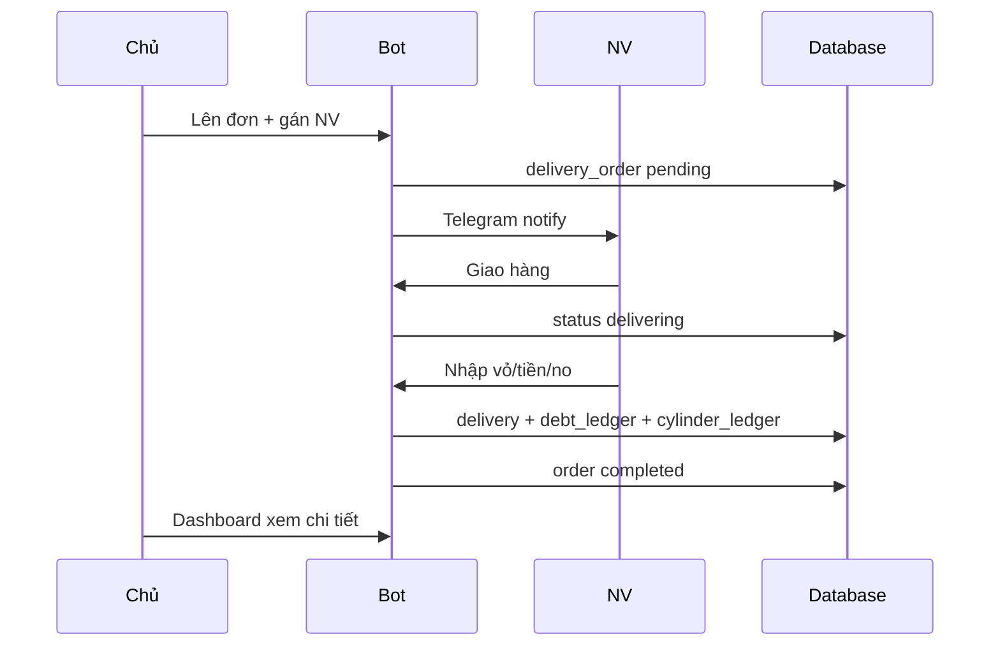

# GasOS — User Flow

**Phiên bản:** 1.0 | **Cập nhật:** 2026-06-24

---

## Mục tiêu

Mô tả luồng người dùng **theo code hiện tại** (Telegram + Web).

---

## A. Kích hoạt tài khoản

```
NV/Owner nhận mã GAS-XXXXXXXX
  → /start <mã> hoặc bấm deep link
  → Tạo user + employee (NV)
  → Menu theo role
```

---

## B. Chủ đại lý — Telegram

### Menu chính

| Nút | Flow |
|-----|------|
| 📞 Lên đơn | Nhập SĐT/tên/địa chỉ → chọn khách → chọn loại bình → số lượng → xác nhận → **chọn NV** → tạo đơn → notify NV |
| 👤 Khách | Thêm / **Tìm khách** / quay menu |
| 📋 Đơn mở | Danh sách pending+delivering → chi tiết → huỷ (chủ) |
| 📊 Thống kê | Ngày / NV / Đơn / **Web** (magic link) |
| ⚙️ Cài đặt | Đơn giá / Mã mời NV |

### Tìm khách → Lên đơn

```
Tìm khách → gõ tên/SĐT/địa chỉ
  → Danh sách + nút 📞 Tên·Địa chỉ
  → Nhấn → chọn bình (flow lên đơn)
```

### Thêm khách

```
Tên | SĐT | Địa chỉ → Xác nhận → Lưu
```

---

## C. Nhân viên — Telegram

### Menu

| Nút | Flow |
|-----|------|
| 📋 Đơn cần giao | Đơn assigned → Xem → **Giao hàng** |
| 💰 Tra nợ | Tên/SĐT/địa chỉ → chọn khách → xem nợ |

### Hoàn thành giao hàng

```
Giao hàng → status delivering
  → Nhập compact: <vỏ thu...> <tiền>vnd <tm|ck|no> [gas kg...]
  → Xác nhận preview
  → ✅ Hoàn thành → delivery + ledger
```

**Ví dụ 1 dòng:** `3 800000vnd tm`  
**Ghi nợ:** `4 3 0vnd no`  
**Nhiều loại bình:** N số vỏ + tiền + tag + gas từng dòng

---

## D. Tra nợ (chung)

```
💰 Tra nợ hoặc /no <query>
  → Tìm theo SĐT chính xác / tên / địa chỉ
  → 1 kết quả: thẻ nợ + địa chỉ
  → Nhiều: nút chọn từng khách
  → Chủ: nút Lên đơn | NV: nút Đơn cần giao
```

---

## E. Web Dashboard (chủ only)

### Đăng nhập

```
Bot /dashboard hoặc Thống kê → Web
  → Link /dashboard?code=...
  → POST magic-link → token 8h
  → /dashboard (SPA)
```

### Trang

| Trang | Thao tác chính |
|-------|----------------|
| Tổng quan | Stats ngày/tháng, chart 14 ngày, đơn mở |
| Doanh thu/Công nợ | Thu nợ, danh sách nợ, lịch sử giao |
| Khách hàng | CRUD, tìm, ẩn, xoá (có điều kiện) |
| Nhân viên | Danh sách, bật/tắt, tạo mã mời |
| Quản lý vỏ | Khách giữ vỏ theo loại |
| **Đơn hàng** | Lọc trạng thái → **click row → chi tiết** |
| **Gas dư trả NM** | Tổng tích lũy/tháng, theo khách (kg giao dịch) |

### Chi tiết đơn (modal)

- Thông tin khách + đơn
- **Tổng hợp khách:** bình đã giao, vỏ giữ, nợ, tiền đã mua, bảng theo loại bình
- Dòng đơn lần này + kết quả giao (nếu completed)
- **Tin nhắn xác nhận** (copy) — chuẩn bị gửi khách sau

---

## F. Luồng đơn hàng end-to-end



---

## Edge cases

- Không có NV active → chặn lên đơn
- Session bot mất khi restart server
- Magic link hết 5 phút
- Employee không vào web (403 owner)

---

## Câu hỏi mở

- Flow gửi tin nhắn khách tự động sau giao?
- NV có cần xem tổng hợp khách trên bot không?

---

## Cần xác nhận

- [ ] Luồng compact syntax NV đủ dễ dùng
- [ ] Luồng web dashboard đủ cho chủ không cần Excel
